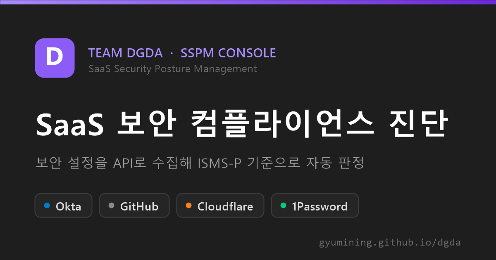
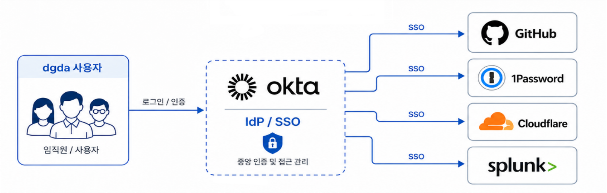
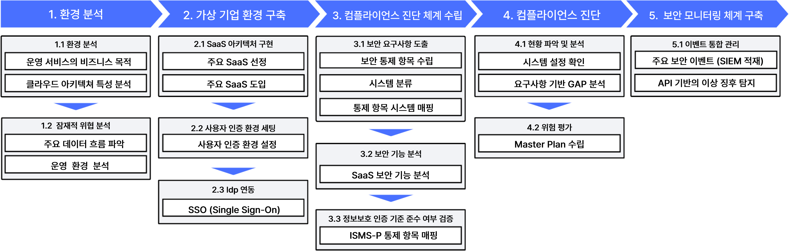
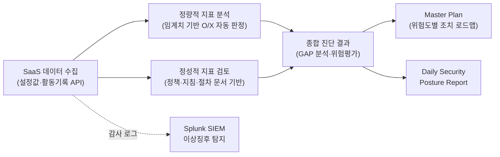
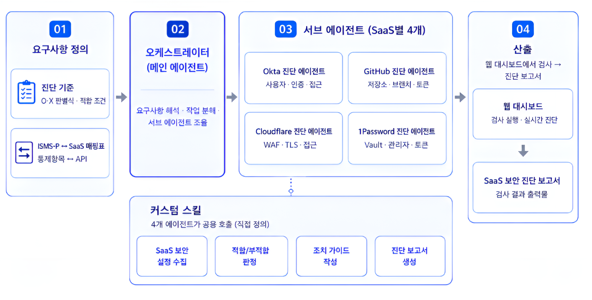
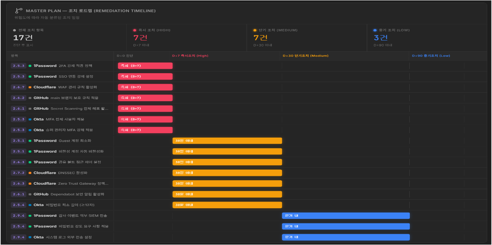
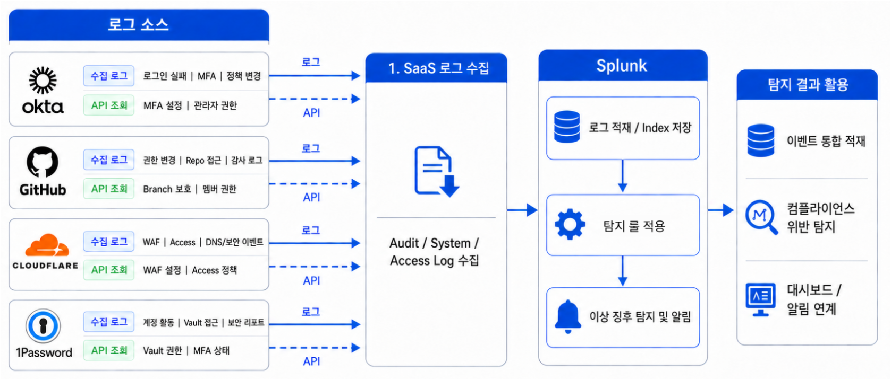
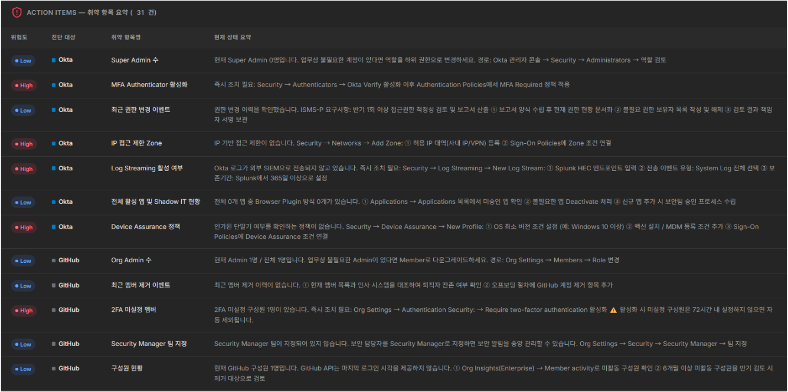
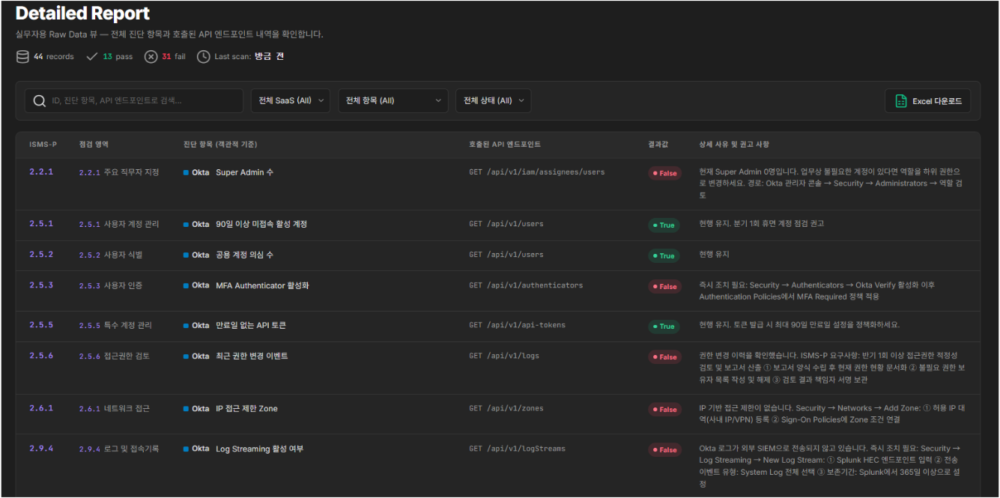
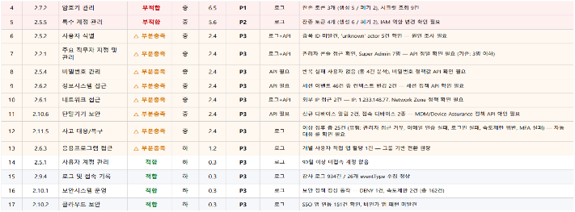

# SSPM Console — 기업용 SaaS 보안 컴플라이언스 진단 체계

> 글로벌 SSPM이 채우지 못하는 **국내 컴플라이언스(ISMS-P) 공백**을 보완하는 SaaS 보안 진단 체계.
> Okta · GitHub · Cloudflare · 1Password의 보안 설정을 API로 수집해 ISMS-P 보호대책 요구사항 기준으로 적합/부적합을 자동 판정하고, Splunk SIEM으로 이상징후까지 탐지합니다.

**🔗 Live Demo → [gyumining.github.io/dgda](https://gyumining.github.io/dgda/)** — 브라우저에서 바로 진단 시연을 해볼 수 있습니다.



---

## 1. 왜 만들었나

- SaaS 도입이 가속화되면서 권한·인증·보안 설정이 수많은 서비스에 파편화되어, 기업이 **자신의 보안 수준을 한눈에 파악하기 어려운** 상황이 됨
- 파편화된 **설정·권한 오류는 전체 SaaS 보안 사고의 약 70%** 를 유발하는 가장 치명적인 사각지대 *(AppOmni, The 2025 State of SaaS Security Report)*
- 이를 해결하기 위해 등장한 것이 SSPM(SaaS Security Posture Management)이지만, Palo Alto Networks·AppOmni·Obsidian 등 **글로벌 SSPM은 ISO 27001 · NIST · SOC 2 같은 국제 표준 위주**로 진단 항목을 제공
- 국내 기업은 SSPM 진단 결과를 **ISMS-P, 개인정보보호법, 정보통신망법 기준으로 다시 해석·매핑**해야 하는 이중 부담을 짐

**→ 그래서 가상 기업의 SaaS 업무 환경을 직접 구축하고, ISMS-P 기준에 맞춘 자체 진단 체계를 설계·구현했습니다.**

## 2. 무엇을 만들었나

| 구성 요소 | 내용 |
|---|---|
| **가상 기업 환경** | Okta를 IdP로 하는 SSO 통합 인증 체계 위에 5개 핵심 SaaS를 연동한 가상 기업 '디그다' 구축 |
| **컴플라이언스 진단 체계** | ISMS-P 보호대책 요구사항을 SaaS별 설정·API에 직접 매핑한 O/X 자동 판별식 설계 |
| **보안 모니터링** | SaaS 감사 로그를 Splunk(SIEM)에 적재하고 탐지 룰로 이상징후 식별 |
| **진단 대시보드 (본 저장소)** | 진단 수행 → 결과 요약 → 조치 우선순위를 보여주는 웹 데모 콘솔 |

### 가상 기업의 SaaS 스택

| SaaS | 역할 |
|---|---|
| **Okta** | SaaS의 관문 — IdP / SSO 통합 인증 |
| **GitHub** | 지적 재산 및 공급망 보안 |
| **Cloudflare** | 외부 노출 접점 — WAF / DNS |
| **1Password** | 자격 증명(Password) 관리 |
| **Splunk** | 보안 로그 무결성 관리 — SIEM |

가상 기업 '디그다'의 임직원은 Okta를 통해 로그인하고, 나머지 SaaS에는 SSO로 접근합니다.



## 3. 진단 체계 설계

프로젝트는 환경 분석 → 가상 기업 환경 구축 → 진단 체계 수립 → 컴플라이언스 진단 → 보안 모니터링의 5단계로 수행했습니다.



### ISMS-P 통제항목 선별

ISMS-P 보호대책 요구사항 **64개** 통제항목을 전수 검토해, SaaS 설정·정책·로그로 증빙 가능하고 자동화·반복 점검이 가능한 항목만 선별했습니다.

```
ISMS-P 보호대책 요구사항 64개 검토
        │  관리적(정책·계약·교육) 항목 제외
        ▼
기술적 점검 가능 항목 42개 선별
        │  동적 로그 상관분석이 필요한 11개는 SIEM 모니터링으로 대체 통제
        ▼
최종 31개 항목 → API 자동화 진단
```

### 정량 + 정성 종합 진단



- **정량적 지표** — API 응답값에 임계치(예: Super Admin ≤ 3명, 90일 미접속 활성 계정 = 0건)를 적용해 기계적으로 O/X 판정 → 주관적 해석을 배제한 Compliance-as-Code
- **정성적 지표** — API로 확인할 수 없는 사내 정책·절차·지침은 문서 검토로 보완 → ISMS-P의 본질인 '관리체계와 이행' 충족

### 판별식 예시

| ISMS-P 항목 | O/X 판별식 | API 판정 조건 (Okta 예시) |
|---|---|---|
| 2.2.1 주요 직무자 지정 및 관리 | Super Admin 계정 수가 임계치(3명)를 초과하지 않는가? | `GET /api/v1/iam/roles` → O: Super Admin ≤ 3명 |
| 2.5.1 사용자 계정 관리 | 90일 이상 미접속 계정이 100% 비활성화 처리되는가? | `GET /api/v1/users?filter=status eq "ACTIVE"` → O: 90일 미로그인 ACTIVE 계정 = 0건 |
| 2.7.2 암호키 관리 | API 토큰·SAML 인증서에 만료일이 설정되고 주기적으로 교체되는가? | `GET /api/v1/tokens` → O: 만료일 미설정 토큰 = 0건 |

동일한 방식으로 GitHub(Secret Scanning, 2FA), Cloudflare(SSL/TLS 인증서, Gateway 정책), 1Password(Vault 권한 분리) 각각에 대한 판별식을 설계했습니다.

## 4. 어떻게 만들었나 — 기준은 직접, 구현은 멀티 에이전트와

- **진단 기준은 전부 팀이 직접 수립했습니다.** ISMS-P 통제항목 전수 검토와 선별, SaaS별 통합 매핑표(Excel), O/X 판별식과 임계치 설계까지 — 인증 기준 원문과 각 SaaS의 보안 기능·API 명세를 직접 분석해 세운 결과물입니다.
- **구현은 AI 멀티 에이전트와 협업했습니다.** 컨설팅 트랙 팀 특성상 개발 전담 인력이 없어, SaaS별(Okta·GitHub·Cloudflare·1Password)로 에이전트를 나눠 설정값·로그 수집(API 연동)과 웹 진단 대시보드 구현을 맡겼습니다.
- 역할 분담은 명확했습니다 — **에이전트는 수집과 코드 작성**을, **팀은 진단 기준의 적합성 검증과 결과 해석·개선 권고**를 담당했습니다. 판정 로직의 근거(어떤 API 응답을 어떤 임계치로 판정할지)는 모두 팀이 정의한 매핑표를 따릅니다.



## 5. 주요 결과

- **44개 점검 항목 중 31개에서 취약점 식별 (70.5%)** — High 위험 14건은 즉시 조치 대상으로 도출
- MFA/2FA 미적용, 악성 트래픽 차단 정책 부재, Vault 과다 공유 등 실제 부적합 사례를 GAP 분석으로 확인하고 **위험도별 Master Plan(조치 로드맵)** 수립
- Splunk 탐지 룰로 MFA 우회 시도(`ABANDONED`), 정책 미적용 통과(`ALLOW`) 등 이상징후를 실시간 식별
- 진단 결과를 요약한 **Daily Security Posture Report** 자동 생성 체계 구현



SaaS 감사 로그와 API 조회값은 Splunk에 통합 적재되어 탐지 룰을 거쳐 이상징후 알림으로 이어집니다.



## 6. 데모 대시보드 (본 저장소)

이 저장소는 위 진단 체계를 시연하는 **웹 데모 콘솔**입니다. 별도 빌드 없이 정적 HTML 단일 파일로 동작합니다.

- **진단 수행** — 4개 SaaS(Okta·GitHub·Cloudflare·1Password) 대상 ISMS-P 기준 적합/부적합 판정 시연
- **결과 대시보드** — 보안 점수, 상태별 건수, SaaS별 진단 현황 차트
- **조치 우선순위** — P0/P1/P2 위험도 기반 우선 조치 대상 제시
- 첫 방문 시 화면 요소별 가이드 투어 제공, 다크/라이트 모드 지원





```bash
# 로컬에서 열기 — 그냥 브라우저로 열면 됩니다
start "웹 진단 대시보드.html"
```

> 데모 데이터는 실제 가상 기업 환경의 진단 결과를 각색한 것으로, 실 운영 자격 증명을 포함하지 않습니다.

## 7. 산출물

| 산출물 | 설명 |
|---|---|
| SSPM 통합 매핑표 | ISMS-P 통제항목 ↔ SaaS별 설정·API 매핑 (Excel) |
| SaaS 보안 상태 진단 보고서 | GAP 분석·위험평가·Master Plan 포함 최종 보고서 |
| Security Posture Report | 자동 생성 일일 보안 진단 리포트 (PDF) |
| 웹 진단 대시보드 | 본 저장소의 데모 콘솔 + 시연 영상 |



## 8. Team Dgda (디그다)

**2026 시큐리티아카데미 7기 — 컨설팅 트랙** (2026.03 ~ 2026.06)

| 이름 | 역할 |
|---|---|
| 이서윤 | PM |
| 오은희 | 팀원 |
| 남규민 | 팀원 |
| 박창현 | 멘토 |
