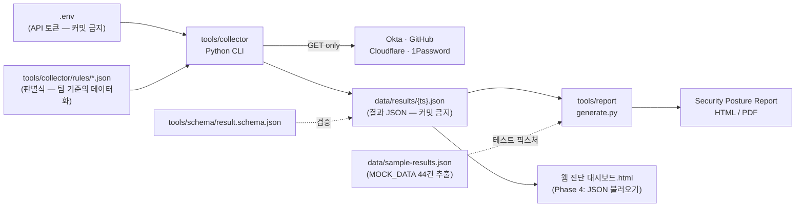

# DESIGN.md — 파생 코드 상세 설계서

[PLAN.md](../PLAN.md)의 Phase 0~4를 실제로 구현할 때 따르는 기술 명세다.
PLAN.md가 "무엇을·어떤 순서로"라면 이 문서는 "정확히 어떻게"를 정의한다.
**구현 중 이 설계와 다르게 결정한 것이 생기면 이 문서를 고치고 같은 커밋에 포함할 것.**

---

## 1. 전체 아키텍처



원칙: 판별식은 **코드가 아닌 rules JSON**에 산다. 코드는 "API를 부르고, 측정값을 뽑고,
evaluator를 적용"하는 범용 엔진이며, 팀 기준이 바뀌면 rules 파일만 수정한다.

---

## 2. 결과 JSON 스키마 (`tools/schema/result.schema.json`)

수집기 출력 = 보고서 생성기 입력 = 대시보드 불러오기 형식. 세 곳 모두 이 스키마 하나만 본다.
항목(item) 필드는 대시보드 `MOCK_DATA`와 **완전 호환**이다 (같은 키, 같은 의미).

```json
{
  "$schema": "http://json-schema.org/draft-07/schema#",
  "title": "SSPM 진단 결과",
  "type": "object",
  "required": ["run", "items"],
  "properties": {
    "run": {
      "type": "object",
      "required": ["timestamp", "collector_version", "targets"],
      "properties": {
        "timestamp":         { "type": "string", "format": "date-time" },
        "collector_version": { "type": "string" },
        "targets":           { "type": "array", "items": { "enum": ["okta", "github", "cloudflare", "onepassword"] } },
        "tenant":            { "type": "object", "description": "SaaS별 대상 식별자(URL·org명 등). 토큰은 절대 넣지 않는다" },
        "skipped":           { "type": "array", "items": { "type": "string" }, "description": "자격증명 부재 등으로 건너뛴 SaaS" },
        "errors":            { "type": "array", "items": { "type": "string" }, "description": "실행 중 발생한 오류 요약" }
      }
    },
    "items": {
      "type": "array",
      "items": {
        "type": "object",
        "required": ["id", "isms", "control", "area", "target", "item",
                     "measured", "criteria", "api", "result", "reason", "rem"],
        "properties": {
          "id":       { "type": "string", "pattern": "^(OT|GH|CF|1P)-[0-9]{2}$" },
          "isms":     { "type": "string", "description": "ISMS-P 보호대책 항목 번호 (예: 2.5.3)" },
          "control":  { "type": "string" },
          "area":     { "enum": ["인적 보안", "인증 및 권한관리", "접근 통제", "암호화",
                                  "로그 관리", "기타 보안", "사고 예방", "시스템 개발 보안"] },
          "target":   { "enum": ["Okta", "GitHub", "Cloudflare", "1Password"] },
          "item":     { "type": "string" },
          "measured": { "type": "string", "description": "실측값 — 사람이 읽는 문자열" },
          "criteria": { "type": "string", "description": "판별식 설명 (rules의 criteria_desc)" },
          "api":      { "type": "string" },
          "result":   { "enum": ["O", "X", "C", "M"] },
          "reason":   { "type": "string" },
          "rem":      { "type": "string", "description": "조치 권고 (SaaS 콘솔 경로 포함)" },
          "error":    { "type": "string", "description": "수집 실패 시에만 존재. 이때 result는 M" },
          "raw":      { "type": "object", "description": "선택 — 판정에 쓴 수치 원본 (예: {\"count\": 3})" }
        }
      }
    }
  }
}
```

결정사항:

- **수집 실패 항목은 result `M` + `error` 필드**로 처리한다. 새 결과 코드를 만들지 않는 이유는
  대시보드 `RESULT_META`(O/X/C/M)와의 호환 유지 — 실패 항목은 "수동확인 필요"로 자연스럽게 흡수된다.
- `raw`는 선택 필드. 보고서에서 수치 재가공이 필요할 때를 위해 카운트 원본만 담고, **응답 전문은 담지 않는다**
  (개인정보·내부 식별자 유출 방지).

---

## 3. 판별식 규칙 파일 명세 (`tools/collector/rules/*.json`)

SaaS당 1파일. 항목 구조:

```json
{
  "id": "OT-04",
  "isms": "2.5.3",
  "control": "사용자 인증",
  "area": "인증 및 권한관리",
  "item": "MFA Authenticator 활성화",
  "api": "/api/v1/authenticators",
  "collect": "active_mfa_count",
  "evaluator": { "type": "count_gte", "threshold": 1 },
  "criteria_desc": "MFA status==ACTIVE → O (법령 필수)",
  "rem_pass": "현행 유지",
  "rem_fail": "즉시 조치: Security → Authenticators → Okta Verify 활성화 후 MFA Required 정책 적용"
}
```

- `collect`: SaaS 모듈이 구현하는 **측정 함수 이름**. 각 SaaS 모듈은 `collect_<이름>() -> Measurement`를 제공한다.
  `Measurement = { count: int|None, display: str, raw: dict }` (display가 스키마의 `measured`가 된다)
- `evaluator.type`은 아래 5종만 허용:

| type | 판정 | 사용 예 |
|---|---|---|
| `count_eq_zero` | count == 0 → O, 아니면 X | 미접속 활성 계정, 2FA 미설정 멤버, open alerts |
| `count_gte` | count ≥ threshold → O, 아니면 X | 활성 IP Zone ≥ 1, 차단 룰 ≥ 1 |
| `all_pass` | `sub`에 나열된 하위 측정이 전부 O → O | CF-13 (차단룰 + Alert 모두 존재) |
| `collect_only` | 판정 없이 **C** — 측정값만 기록 | 관리자 수 집계(팀 판단 항목), 이력 증적 |
| `manual` | API 미지원 — 항상 **M**, 콘솔 확인 경로를 rem으로 안내 | 1P-07·08·09 |

- `rem_pass`/`rem_fail`: 판정 결과에 따라 스키마 `rem`에 들어갈 문구. `collect_only`/`manual`은 `rem` 단일 키 사용.
- 문구(criteria_desc·rem)는 대시보드 `MOCK_DATA`의 해당 항목 텍스트를 **그대로 옮긴다** — 임의 수정 금지.

---

## 4. 수집기 상세 설계 (`tools/collector`)

### 4.1 CLI

```
python -m tools.collector --saas okta,github,cloudflare,onepassword \
                          --out data/results/ \
                          [--item OT-04,GH-07]   # 특정 항목만
                          [--dry-run]            # API 호출 없이 규칙·자격증명 준비상태 점검
```

- 출력 파일명: `data/results/{UTC ISO8601, 콜론은 -로}.json`
- 종료 코드: `0` 전체 성공 · `1` 부분 성공(일부 SaaS 스킵/항목 오류 — run.skipped·errors에 기록) · `2` 실행 불가
- 마지막에 요약 한 줄 출력: `44개 항목 — O 15 · X 14 · C 9 · M 3 · 오류 3 (github 스킵)`

### 4.2 환경변수 — `.env.example`로 키 이름만 커밋

```bash
# Okta (SSWS API 토큰 — Read-Only Administrator 권한으로 발급)
OKTA_ORG_URL=https://trial-xxxxxxx-admin.okta.com
OKTA_API_TOKEN=

# GitHub (fine-grained PAT — Organization read 권한. 2FA 필터는 org owner 필요)
GITHUB_TOKEN=
GITHUB_ORG=
GITHUB_REPOS=            # 콤마 구분. 비우면 org 저장소 자동 열거

# Cloudflare (계정/존 권한 분리 주의 — Account Read + Zone Read 스코프 토큰)
CLOUDFLARE_API_TOKEN=
CLOUDFLARE_ACCOUNT_ID=
CLOUDFLARE_ZONE_ID=

# 1Password Connect (로컬 Connect 서버)
OP_CONNECT_HOST=http://localhost:8080
OP_CONNECT_TOKEN=
```

### 4.3 공통 계층 (`saas/base.py`)

- 인증 헤더 조립: Okta `Authorization: SSWS {token}` / GitHub `Bearer` + `X-GitHub-Api-Version: 2022-11-28`
  / Cloudflare `Bearer` / 1Password `Bearer`
- 페이지네이션: Okta·GitHub는 `Link: rel="next"` 헤더, Cloudflare는 `result_info.page` — 공통 인터페이스로 흡수
- 재시도: 429·5xx에 지수 백오프 최대 3회 (Okta는 `x-rate-limit-reset` 헤더 준수)
- 타임아웃 10초. 실패 시 예외를 항목 단위로 잡아 `error` 필드 처리 — **한 항목 실패가 전체 실행을 죽이지 않는다**

### 4.4 SaaS별 항목 명세 (44개 전체)

기준: 대시보드 `MOCK_DATA`(criteria 필드)와 README 판별식 표. `→O` 표기는 해당 evaluator 통과 시 적합.

#### Okta (OT-01~10) — `rules/okta.json`

| ID | ISMS-P | 측정 | 엔드포인트 | evaluator |
|---|---|---|---|---|
| OT-01 | 2.2.1 | Super Admin 역할 계정 수 | `/api/v1/iam/roles` + 역할 할당 조회 | `collect_only` (팀 판단) |
| OT-02 | 2.5.1 | 90일 이상 미접속 ACTIVE 계정 수 (`lastLogin` 기준) | `/api/v1/users?filter=status eq "ACTIVE"` | `count_eq_zero` |
| OT-03 | 2.5.2 | 공용 계정 패턴(admin@·shared@·test@) 계정 수 | `/api/v1/users` | `count_eq_zero` |
| OT-04 | 2.5.3 | status ACTIVE인 MFA authenticator 수 | `/api/v1/authenticators` | `count_gte 1` |
| OT-05 | 2.5.5 | 만료일 미설정 API 토큰 수 | `/api/v1/api-tokens` | `count_eq_zero` |
| OT-06 | 2.5.6 | 최근 권한 변경 이벤트 수 | `/api/v1/logs?filter=eventType sw "user.account"` | `collect_only` |
| OT-07 | 2.6.1 | 활성 Network Zone 수 | `/api/v1/zones` | `count_gte 1` |
| OT-08 | 2.9.4 | 활성 Log Stream 수 | `/api/v1/logStreams` | `count_gte 1` |
| OT-09 | 2.10.2 | 활성 앱 수 + 미승인 의심(Browser Plugin 방식) 수 | `/api/v1/apps` | `collect_only` |
| OT-10 | 2.10.6 | Device Assurance 정책 수 | `/api/v1/device-assurances` | `count_gte 1` |

#### GitHub (GH-01~12) — `rules/github.json`

| ID | ISMS-P | 측정 | 엔드포인트 | evaluator |
|---|---|---|---|---|
| GH-01 | 2.2.1 | Org Admin 수 / 전체 멤버 수 | `/orgs/{org}/members?role=admin` | `collect_only` |
| GH-02 | 2.5.1 | `remove_member` 감사 이벤트 수 | `/orgs/{org}/audit-log` *(Enterprise Cloud 전용 — 미가용 시 error→M)* | `collect_only` |
| GH-03 | 2.5.2 | 공용/봇 패턴 계정 수 | `/orgs/{org}/members` | `count_eq_zero` |
| GH-04 | 2.5.3 | 2FA 미설정 멤버 수 | `/orgs/{org}/members?filter=2fa_disabled` *(org owner 토큰 필요)* | `count_eq_zero` |
| GH-05 | 2.5.5 | Security Manager 지정 팀 수 | `/orgs/{org}/security-managers` | `collect_only` |
| GH-06 | 2.5.6 | 전체 구성원 수 (API가 마지막 로그인 미제공 — 기존 판정과 동일하게 C) | `/orgs/{org}/members` | `collect_only` |
| GH-07 | 2.7.1 | org 수준 open secret scanning alerts | `/orgs/{org}/secret-scanning/alerts?state=open` | `count_eq_zero` |
| GH-08 | 2.8.5 | 기본 브랜치 보호 **미적용** 저장소 수 | 저장소 열거 → `/repos/{o}/{r}/branches/{default}/protection` (404=미적용) | `count_eq_zero` |
| GH-09 | 2.9.4 | 활성 Audit log stream 수 | Enterprise audit-log streaming API *(Enterprise 전용 — 미가용 시 error→M)* | `count_gte 1` |
| GH-10 | 2.10.5 | repo 수준 open secret scanning alerts 합계 | `/repos/{o}/{r}/secret-scanning/alerts?state=open` | `count_eq_zero` |
| GH-11 | 2.10.8 | Dependabot critical open alerts 합계 | `/repos/{o}/{r}/dependabot/alerts?state=open&severity=critical` | `count_eq_zero` |
| GH-12 | 2.11.2 | GH-11 + GH-10 합계 | (재사용 — 추가 호출 없음) | `all_pass [GH-11, GH-10]` |

#### Cloudflare (CF-01~13) — `rules/cloudflare.json`

> ⚠️ `/zones/{id}/firewall/rules`·`/firewall/waf/packages`는 **legacy API**다. 신규 테넌트는
> Rulesets API(`/zones/{id}/rulesets`)로만 노출될 수 있으므로, 구현 시 legacy 404면 rulesets로
> 폴백해 동일 의미(차단 룰 존재 여부)를 측정한다. 폴백 사용 여부를 `raw`에 기록.

| ID | ISMS-P | 측정 | 엔드포인트 | evaluator |
|---|---|---|---|---|
| CF-01 | 2.2.1 | Super Administrator 수 / 전체 멤버 수 | `/accounts/{id}/members` | `collect_only` |
| CF-02 | 2.5.3 | 2FA 미설정 멤버 수 | `/accounts/{id}/members` (`two_factor_authentication_enabled`) | `count_eq_zero` |
| CF-03 | 2.5.5 | 만료일 없는 API 토큰 수 | `/user/tokens` | `count_eq_zero` |
| CF-04 | 2.6.1 | block/challenge 방화벽 룰 수 | `/zones/{id}/firewall/rules` *(→ rulesets 폴백)* | `count_gte 1` |
| CF-05 | 2.6.3 | IdP 연동 Access 앱 수 | `/accounts/{id}/access/apps` | `count_gte 1` |
| CF-06 | 2.6.7 | Gateway block 룰 수 | `/accounts/{id}/gateway/rules` | `count_gte 1` |
| CF-07 | 2.9.2 | 활성 Alert 정책 수 | `/accounts/{id}/alerting/v3/policies` | `count_gte 1` |
| CF-08 | 2.9.4 | 활성 Logpush job 수 | `/zones/{id}/logpush/jobs` | `count_gte 1` |
| CF-09 | 2.10.1 | 활성 WAF managed 룰셋 수 | `/zones/{id}/firewall/waf/packages` *(→ rulesets 폴백)* | `count_gte 1` |
| CF-10 | 2.10.3 | Proxy(`proxied=false`) 미적용 A/AAAA/CNAME 레코드 수 | `/zones/{id}/dns_records` | `count_eq_zero` |
| CF-11 | 2.10.6 | Device Posture 정책 수 | `/accounts/{id}/devices/posture` | `count_gte 1` |
| CF-12 | 2.10.9 | Malware 카테고리 차단 Gateway 룰 수 | `/accounts/{id}/gateway/rules` (CF-06 응답 재사용) | `count_gte 1` |
| CF-13 | 2.11.5 | 차단 룰 존재 **AND** Alert 정책 존재 | (CF-04·CF-07 재사용) | `all_pass [CF-04, CF-07]` |

#### 1Password (1P-01~09) — `rules/onepassword.json`

| ID | ISMS-P | 측정 | 엔드포인트 | evaluator |
|---|---|---|---|---|
| 1P-01 | 2.5.1 | 비활성·정지 상태 잔존 계정 수 | `/v1/users` | `count_eq_zero` |
| 1P-02 | 2.5.5 | Owner/Admin 성격 그룹 수 | `/v1/groups` | `collect_only` |
| 1P-03 | 2.5.5 | 그룹 구성원 목록 수집 성공 여부 (성공=1) | `/v1/groups/{id}/members` | `count_gte 1` |
| 1P-04 | 2.5.6 | 식별된 Vault 수 (식별 성공 시 O) | `/v1/vaults` | `count_gte 1` |
| 1P-05 | 2.5.6 | Vault별 접근권한 수집 성공 여부 | `/v1/vaults/{id}/groups` | `count_gte 1` |
| 1P-06 | 2.6.3 | 전체공개 Vault 수 + 최소 권한 검토 필요 | `/v1/vaults/{id}/groups` (1P-05 재사용) | `collect_only` |
| 1P-07 | 2.5.3 | 2FA 강제 정책 — API 미지원 | — | `manual` |
| 1P-08 | 2.9.4 | 감사 로그 SIEM 연동 — 콘솔 확인 | `/api/v2/auditevents` 연동 상태 | `manual` |
| 1P-09 | 2.9.5 | 이상행위 점검 절차 — API 미지원 | — | `manual` |

### 4.5 오류 처리 정책

| 상황 | 처리 |
|---|---|
| SaaS 자격증명(.env 키) 부재 | 해당 SaaS 전체 스킵 — `run.skipped`에 기록, 종료 코드 1 |
| 항목 API 4xx/5xx (재시도 소진) | 항목 result `M` + `error` 기록, 나머지 항목 계속 |
| 권한 부족(403) — 예: GH-04 org owner 아님 | 위와 동일하되 `error`에 필요한 권한 명시 |
| 응답 형식 예상 밖 | 항목 `M` + `error` — **절대 임의 해석으로 O/X를 내지 않는다** |

---

## 5. 보고서 생성기 상세 설계 (`tools/report`)

### 5.1 CLI

```
python -m tools.report data/results/2026-08-21T00-00-00Z.json --out reports/ [--pdf]
```

입력이 스키마 검증에 실패하면 즉시 종료(코드 2). `--pdf` 없이도 HTML은 항상 생성.

### 5.2 위험도 산정 — 대시보드 `riskProfile()` 포팅 (수치 동일 유지)

```python
HIGH_AREAS = ["인적 보안", "인증 및 권한관리", "암호화"]

def risk_profile(item):
    if item["result"] == "X":
        risk = "상" if item["area"] in HIGH_AREAS else "중"
        score = 8.5 if risk == "상" else 6.5
    elif item["result"] == "O":
        risk, score = "하", 0.3
    else:  # C, M
        risk, score = "중", 2.4
    prio = "P0" if score >= 8 else "P1" if score >= 6 else "P3"
    dtype = "콘솔 확인" if item["result"] == "M" else "API 수집"
    return risk, score, prio, dtype
```

전체 보안 점수 산식은 대시보드 `updateSummaryView()`의 계산을 **구현 시점에 해당 함수를 읽고
그대로 이식**한다 (이 문서에 수치를 새로 정의하지 않는다 — 두 산출물의 점수가 달라지면 안 되므로).

### 5.3 보고서 구성 (`templates/report.html`)

대시보드 `buildPrintReport()`의 인쇄 보고서 구성을 따른다:

1. **표지/메타** — 생성 시각, 대상 SaaS·테넌트, collector 버전, 스킵된 SaaS 고지
2. **총평** — 보안 점수, O/X/C/M 건수, SaaS별 적합률
3. **조치 우선순위** — P0/P1/P3별 부적합 항목 (위험도 상 → 하 정렬, `rem` 포함)
4. **상세 항목 표** — 44개 전체: ISMS-P 번호·항목·실측값·판정·근거·권고
5. **부록** — 수집 오류(error 항목) 목록과 수동확인(M) 안내

스타일은 단일 HTML 안에 인라인 (대시보드와 동일 원칙 — 외부 의존 없음).

### 5.4 PDF 변환 전략 (Windows 우선)

1. **1순위 — Edge headless** (무설치): `msedge --headless --print-to-pdf=out.pdf file:///...html`
2. 2순위 — `weasyprint` (Windows는 GTK 런타임 필요 — 설치 부담 있으므로 옵션으로만)
3. 항상 가능 — HTML을 브라우저에서 열고 Ctrl+P (수동 폴백)

`--pdf`는 1순위를 시도하고 실패 시 HTML 경로와 수동 변환 안내를 출력한다.

---

## 6. 테스트·검증

- `data/sample-results.json`(MOCK_DATA 44건 추출본)은 **스키마의 회귀 테스트 픽스처**다:
  스키마를 바꿀 때마다 샘플이 통과하는지 확인 → 대시보드 호환이 깨지지 않았다는 보증
- 수집기: `--dry-run`으로 rules 44건 로드·자격증명 준비상태를 API 호출 없이 점검
- 보고서: 샘플 JSON으로 생성한 보고서의 건수·P0 목록이 대시보드 화면과 일치해야 한다
  (동일 데이터 → 동일 판정·동일 위험도가 나오는지가 핵심 검증)
- 실제 테넌트 수집 결과가 기존 진단 보고서와 다르면 코드보다 **팀 판별식 기준과 먼저 대조** (PLAN.md 검증 원칙)

## 7. 구현 커밋 단위 가이드

작게 자주 커밋한다. 권장 단위:

1. 스키마 + 샘플 데이터 추출 (Phase 0 완결)
2. CLI 골격 + base.py + rules 로더 (`--dry-run` 동작까지)
3. Okta rules + 모듈 (Phase 1 완결)
4. GitHub / Cloudflare / 1Password — SaaS당 1커밋
5. 보고서 템플릿 + generate.py / PDF 변환 — 각 1커밋
6. (Phase 4) 대시보드 JSON 불러오기

각 커밋 후 CLAUDE.md·PLAN.md 체크박스 갱신을 잊지 말 것.
